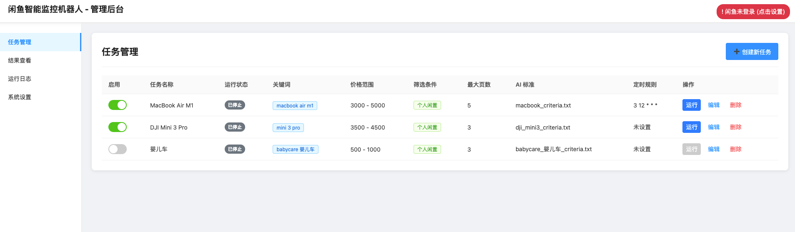
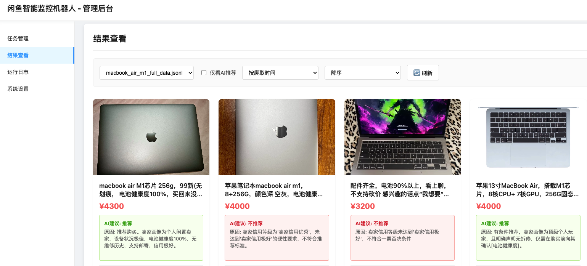
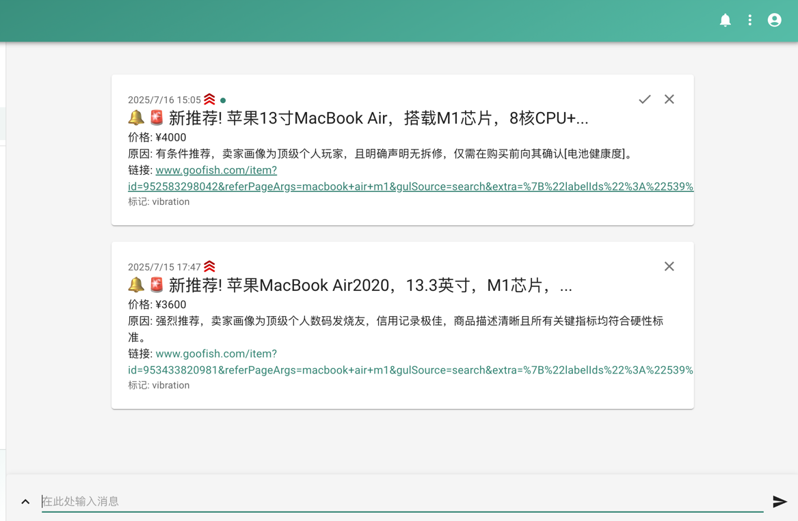
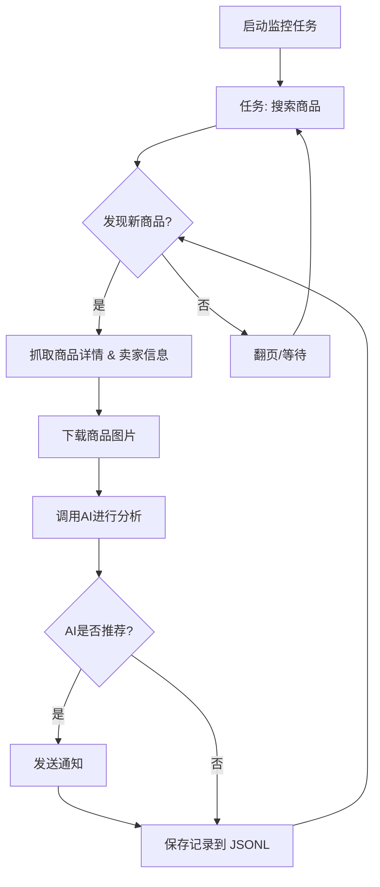

# 闲鱼(goofish)智能监控机器人

一个基于 Playwright 和AI过滤分析的闲鱼(goofish)多任务实时监控与智能分析工具，配备了功能完善的 Web 管理界面。

## ✨ 项目亮点

- **可视化Web界面**: 提供完整的Web UI，支持任务的可视化管理、AI标准在线编辑、运行日志实时查看和结果筛选浏览，无需直接操作命令行和配置文件。
- **AI驱动的任务创建**: 只需用自然语言描述你的购买需求，即可一键创建包含复杂筛选逻辑的全新监控任务。
- **多任务并发**: 通过 `config.json` 同时监控多个关键词，各任务独立运行，互不干扰。
- **实时流式处理**: 发现新商品后，立即进入分析流程，告别批处理延迟。
- **深度AI分析**: 集成多模态大语言模型（如 GPT-4o），结合商品图文和卖家画像进行深度分析，精准筛选。
- **高度可定制**: 每个监控任务均可配置独立的关键词、价格范围、筛选条件和AI分析指令 (Prompt)。
- **即时通知**: 支持通过 [ntfy.sh](https://ntfy.sh/)、企业微信群机器人和 [Bark](https://bark.day.app/)，将符合AI推荐的商品立即推送到你的手机或桌面。
- **定时任务调度**: 支持 Cron 表达式，可为每个任务设置独立的定时执行计划。
- **Docker 一键部署**: 提供 `docker-compose` 配置，实现快速、标准化的容器化部署。
- **健壮的反爬策略**: 模拟真人操作，包含多种随机延迟和用户行为，提高稳定性。

## 页面截图

**后台任务管理**


**后台监控截图**


**ntf通知截图**


## 🚀 快速开始 (Web UI 推荐)

推荐使用 Web 管理界面来操作本项目，体验最佳。

### 第 1 步: 环境准备

> ⚠️ **Python版本要求**: 本地部署调试时建议使用 Python 3.10 或更高版本。较低版本的Python可能会导致依赖包安装失败或运行时错误（如 `ModuleNotFoundError: No module named 'PIL'`）。

克隆本项目到本地:

```bash
git clone https://github.com/dingyufei615/ai-goofish-monitor
cd ai-goofish-monitor
```

安装所需的Python依赖：

```bash
pip install -r requirements.txt
```

### 第 2 步: 基础配置

1. **配置环境变量**: 复制`.env.example`文件并命名为`.env`，并修改里面的内容。  

    Windows使用命令行：

    ```cmd
    copy .env.example .env
    ```

    Linux/MacOS使用命令行：

    ```shell
    cp .env.example .env
    ```

    `.env` 文件中的所有可用配置项如下：

    | 环境变量 | 说明 | 是否必填 | 注意事项 |
    | :--- | :--- | :--- | :--- |
    | `OPENAI_API_KEY` | 你的AI模型服务商提供的API Key。 | 是 | 对于某些本地或特定代理的服务，此项可能为可选。 |
    | `OPENAI_BASE_URL` | AI模型的API接口地址，必须兼容OpenAI格式。 | 是 | 请填写API的基础路径，例如 `https://ark.cn-beijing.volces.com/api/v3/`。 |
    | `OPENAI_MODEL_NAME` | 你要使用的具体模型名称。 | 是 | **必须**选择一个支持图片分析的多模态模型，如 `doubao-seed-1-6-250615`, `gemini-2.5-pro` 等。 |
    | `PROXY_URL` | (可选) 需要翻墙时配置的HTTP/S代理。 | 否 | 支持 `http://` 和 `socks5://` 格式。例如 `http://127.0.0.1:7890`。 |
    | `NTFY_TOPIC_URL` | (可选) [ntfy.sh](https://ntfy.sh/) 的主题URL，用于发送通知。 | 否 | 如果留空，将不会发送 ntfy 通知。 |
    | `GOTIFY_URL` | (可选) Gotify 服务地址。 | 否 | 例如 `https://push.example.de`。 |
    | `GOTIFY_TOKEN` | (可选) Gotify 应用的 Token。 | 否 | |
    | `BARK_URL` | (可选) [Bark](https://bark.day.app/) 的推送地址。 | 否 | 例如 `https://api.day.app/your_key`。如果留空，将不发送 Bark 通知。 |
    | `WX_BOT_URL` | (可选) 企业微信群机器人的 Webhook 地址。 | 否 | 如果留空，将不会发送企业微信通知。注意：在 `.env` 文件中配置此值时，请确保 URL 地址用双引号包围，否则可能导致配置不生效。 |
    | `WEBHOOK_URL` | (可选) 通用 Webhook 的 URL 地址。 | 否 | 如果留空，将不发送通用 Webhook 通知。 |
    | `WEBHOOK_METHOD` | (可选) Webhook 请求方法。 | 否 | 支持 `GET` 或 `POST`，默认为 `POST`。 |
    | `WEBHOOK_HEADERS` | (可选) Webhook 的自定义请求头。 | 否 | 必须是有效的 JSON 字符串，例如 `'{"Authorization": "Bearer xxx"}'`。 |
    | `WEBHOOK_CONTENT_TYPE` | (可选) POST 请求的内容类型。 | 否 | 支持 `JSON` 或 `FORM`，默认为 `JSON`。 |
    | `WEBHOOK_QUERY_PARAMETERS` | (可选) GET 请求的查询参数。 | 否 | JSON 字符串，支持 `{{title}}` 和 `{{content}}` 占位符。 |
    | `WEBHOOK_BODY` | (可选) POST 请求的请求体。 | 否 | JSON 字符串，支持 `{{title}}` 和 `{{content}}` 占位符。 |
    | `LOGIN_IS_EDGE` | 是否使用 Edge 浏览器进行登录和爬取。 | 否 | 默认为 `false`，使用 Chrome/Chromium。 |
    | `PCURL_TO_MOBILE` | 是否在通知中将电脑版商品链接转换为手机版。 | 否 | 默认为 `true`。 |
    | `RUN_HEADLESS` | 是否以无头模式运行爬虫浏览器。 | 否 | 默认为 `true`。在本地调试遇到验证码时可设为 `false` 手动处理。**Docker部署时必须为 `true`**。 |
    | `AI_DEBUG_MODE` | 是否开启AI调试模式。 | 否 | 默认为 `false`。开启后会在控制台打印详细的AI请求和响应日志。 |
    | `SKIP_AI_ANALYSIS` | 是否跳过AI分析并直接发送通知。 | 否 | 默认为 `false`。设置为 `true` 时，所有爬取到的商品将直接发送通知而不经过AI分析。 |
    | `ENABLE_THINKING` | 是否启用enable_thinking参数。 | 否 | 默认为 `false`。某些AI模型需要此参数，而有些则不支持。如果遇到"Invalid JSON payload received. Unknown name "enable_thinking""错误，请尝试设置为 `false`。 |
    | `SERVER_PORT` | Web UI服务的运行端口。 | 否 | 默认为 `8000`。 |
    | `WEB_USERNAME` | Web界面登录用户名。 | 否 | 默认为 `admin`。生产环境请务必修改。 |
    | `WEB_PASSWORD` | Web界面登录密码。 | 否 | 默认为 `admin123`。生产环境请务必修改为强密码。 |

    > 💡 **调试建议**: 如果在配置AI API时遇到404错误，建议先使用阿里云或火山提供的API进行调试，确保基础功能正常后再尝试其他API提供商。某些API提供商可能存在兼容性问题或需要特殊的配置。

    > 🔐 **安全提醒**: Web界面已启用Basic认证保护。默认用户名和密码为 `admin` / `admin123`，生产环境请务必修改为强密码！

2. **获取登录状态 (重要!)**: 为了让爬虫能够以登录状态访问闲鱼，必须先提供有效的登录凭证。我们推荐使用Web UI来完成此操作：

    **推荐方式：通过 Web UI 更新**
    1. 先跳过此步骤，直接执行第3步启动Web服务。
    2. 打开Web UI后，进入 **"系统设置"** 页面。
    3. 找到 "登录状态文件"，点击 **"手动更新"** 按钮。
    4. 按照弹窗内的详细指引操作：
       - 在您的个人电脑上，使用Chrome浏览器安装[闲鱼登录状态提取扩展](https://chromewebstore.google.com/detail/xianyu-login-state-extrac/eidlpfjiodpigmfcahkmlenhppfklcoa)
       - 打开并登录闲鱼官网
       - 登录成功后，点击浏览器工具栏中的扩展图标
       - 点击"提取登录状态"按钮获取登录信息
       - 点击"复制到剪贴板"按钮
       - 将复制的内容粘贴到Web UI中保存即可

    这种方式无需在服务器上运行带图形界面的程序，最为便捷。

    **备用方式：运行登录脚本**
    如果您可以在本地或带桌面的服务器上运行程序，也可以使用传统的脚本方式：

    ```bash
    python login.py
    ```

    运行后会弹出一个浏览器窗口，请使用**手机闲鱼App扫描二维码**完成登录。成功后，程序会自动关闭，并在项目根目录生成一个 `xianyu_state.json` 文件。

### 第 3 步: 启动 Web 服务

一切就绪后，启动 Web 管理后台服务器。

```bash
python web_server.py
```

### 第 4 步: 开始使用

在浏览器中打开 `http://127.0.0.1:8000` 访问管理后台。

1. 在 **“任务管理”** 页面，点击 **“创建新任务”**。
2. 在弹出的窗口中，用自然语言描述你的购买需求（例如：“我想买一台95新以上的索尼A7M4相机，预算1万3以内，快门数低于5000”），并填写任务名称、关键词等信息。
3. 点击创建，AI将自动为你生成一套复杂的分析标准。
4. 回到主界面，为任务添加定时或直接点击启动，开始自动化监控！

## 🐳 Docker 部署 (推荐)

使用 Docker 可以将应用及其所有依赖项打包到一个标准化的单元中，实现快速、可靠和一致的部署。

### 第 1 步: 环境准备 (与本地部署类似)

1. **安装 Docker**: 请确保你的系统已安装 [Docker Engine](https://docs.docker.com/engine/install/)。

2. **克隆项目并配置**:

    ```bash
    git clone https://github.com/dingyufei615/ai-goofish-monitor
    cd ai-goofish-monitor
    ```

3. **创建 `.env` 文件**: 参考 **[快速开始](#-快速开始-web-ui-推荐)** 部分的说明，在项目根目录创建并填写 `.env` 文件。

4. **获取登录状态 (关键步骤!)**: Docker容器内无法进行扫码登录。请在**启动容器后**，通过访问Web UI来设置登录状态：
    1. （在宿主机上）执行 `docker-compose up -d` 启动服务。
    2. 在浏览器中打开 `http://127.0.0.1:8000` 访问Web UI。
    3. 进入 **"系统设置"** 页面，点击 **"手动更新"** 按钮。
    4. 按照弹窗内的指引操作：
       - 在您的个人电脑上，使用Chrome浏览器安装[闲鱼登录状态提取扩展](https://chromewebstore.google.com/detail/xianyu-login-state-extrac/eidlpfjiodpigmfcahkmlenhppfklcoa)
       - 打开并登录闲鱼官网
       - 登录成功后，点击浏览器工具栏中的扩展图标
       - 点击"提取登录状态"按钮获取登录信息
       - 点击"复制到剪贴板"按钮
       - 将复制的内容粘贴到Web UI中保存即可

> ℹ️ **关于Python版本**: 使用Docker部署时，项目使用的是Dockerfile中指定的Python 3.11版本，无需担心本地Python版本兼容性问题。

### 第 2 步: 运行 Docker 容器

项目已包含 `docker-compose.yaml` 文件，我们推荐使用 `docker-compose` 来管理容器，这比使用 `docker run` 更方便。

在项目根目录下，运行以下命令来启动容器：

```bash
docker-compose up --build -d
```

这会以后台模式启动服务。`docker-compose` 会自动读取 `.env` 文件和 `docker-compose.yaml` 的配置，并根据其内容来创建和启动容器。

如果容器内遇到网络问题，请自行排查或使用代理。

> ⚠️ **OpenWrt 环境部署注意事项**: 如果您在 OpenWrt 路由器上部署此应用，可能会遇到 DNS 解析问题。这是因为 Docker Compose 创建的默认网络可能无法正确继承 OpenWrt 的 DNS 设置。如果遇到 `ERR_CONNECTION_REFUSED` 错误，请检查您的容器网络配置，可能需要手动配置 DNS 或调整网络模式以确保容器可以正常访问外部网络。

### 第 3 步: 访问和管理

- **访问 Web UI**: 在浏览器中打开 `http://127.0.0.1:8000`。
- **查看实时日志**: `docker-compose logs -f`
- **停止容器**: `docker-compose stop`
- **启动已停止的容器**: `docker-compose start`
- **停止并移除容器**: `docker-compose down`

## 📸 Web UI 功能一览

- **任务管理**:
  - **AI创建任务**: 使用自然语言描述需求，一键生成监控任务和配套AI分析标准。
  - **可视化编辑与控制**: 在表格中直接修改任务参数（如关键词、价格、定时规则等），并能独立启/停、删除每个任务。
  - **定时调度**: 为任务配置 Cron 表达式，实现自动化周期性运行。
- **结果查看**:
  - **卡片式浏览**: 以图文卡片形式清晰展示每个符合条件的商品。
  - **智能筛选与排序**: 可一键筛选出所有被AI标记为“推荐”的商品，并支持按爬取时间、发布时间、价格等多种方式排序。
  - **深度详情**: 点击即可查看每个商品的完整抓取数据和AI分析的详细JSON结果。
- **运行日志**:
  - **实时日志流**: 在网页上实时查看爬虫运行的详细日志，方便追踪进度和排查问题。
  - **日志管理**: 支持自动刷新、手动刷新和一键清空日志。
- **系统设置**:
  - **状态检查**: 一键检查 `.env` 配置、登录状态等关键依赖是否正常。
  - **Prompt在线编辑**: 直接在网页上编辑和保存用于AI分析的 `prompt` 文件，实时调整AI的思考逻辑。

## 🚀 工作流程

下图描述了单个监控任务从启动到完成的核心处理逻辑。在实际使用中，`web_server.py` 会作为主服务，根据用户操作或定时调度来启动一个或多个这样的任务进程。



## 🔐 Web界面认证

### 认证配置

Web界面已启用Basic认证保护，确保只有授权用户才能访问管理界面和API。

#### 配置方法

在 `.env` 文件中设置认证凭据：

```bash
# Web服务认证配置
WEB_USERNAME=admin
WEB_PASSWORD=admin123
```

#### 默认凭据

如果未在 `.env` 文件中设置认证凭据，系统将使用以下默认值：
- 用户名：`admin`
- 密码：`admin123`

**⚠️ 重要：生产环境请务必修改默认密码！**

#### 认证范围

- **需要认证**：所有API端点、Web界面、静态资源
- **无需认证**：健康检查端点 (`/health`)

#### 使用方法

1. **浏览器访问**：访问Web界面时会弹出认证对话框
2. **API调用**：需要在请求头中包含Basic认证信息
3. **前端JavaScript**：会自动处理认证，无需修改

#### 安全建议

1. 修改默认密码为强密码
2. 生产环境使用HTTPS协议
3. 定期更换认证凭据
4. 通过防火墙限制访问IP范围

详细配置说明请参考 [AUTH_README.md](AUTH_README.md)。

## 常见问题 (FAQ)

我们整理了一份详细的常见问题解答文档，覆盖了从环境配置、AI设置到反爬虫策略的各类问题。

👉 **[点击此处查看常见问题解答 (FAQ.md)](FAQ.md)**

## 致谢

本项目在开发过程中参考了以下优秀项目，特此感谢：

- [superboyyy/xianyu_spider](https://github.com/superboyyy/xianyu_spider)

以及感谢LinuxDo相关人员的脚本贡献

- [@jooooody](https://linux.do/u/jooooody/summary)

以及感谢 [LinuxDo](https://linux.do/) 社区。

以及感谢 ClaudeCode/ModelScope/Gemini 等模型/工具，解放双手 体验Vibe Coding的快乐。

## 体会
本项目 90%+ 的代码都由AI生成，包括 ISSUE 中涉及的 PR 。

Vibe Coding 的可怕之处在于如果不过多的参与项目建设，对AI生成的代码没有进行细致的review，没有思考过AI为什么这么写，盲目的通过跑测试用例验证功能可用性只会导致项目变成一个黑盒。

同样再用AI对AI生成的代码进行code review时，就像是用AI来验证另一个AI的回答是不是AI，陷入了自我证明的困境之中，所以AI可以辅助分析，但不应该成为真相的仲裁者。

AI是万能的，能帮助开发者解决99%的编码问题，AI同样不是万能，解决的每一个问题都需要开发者去验证思考一遍，AI是辅助，AI产出的内容也只能是辅助。

## ⚠️ 注意事项

- 请遵守闲鱼的用户协议和robots.txt规则，不要进行过于频繁的请求，以免对服务器造成负担或导致账号被限制。
- 本项目仅供学习和技术研究使用，请勿用于非法用途。
- 本项目采用 [MIT 许可证](LICENSE) 发布，按"现状"提供，不提供任何形式的担保。
- 项目作者及贡献者不对因使用本软件而导致的任何直接、间接、附带或特殊的损害或损失承担责任。
- 如需了解更多详细信息，请查看 [免责声明](DISCLAIMER.md) 文件。


# 运行爬虫（推荐）
py spider_v2.py

# 运行登录
py login.py

# 运行Web服务器
py web_server.py

# 或者双击运行
run_python3.bat